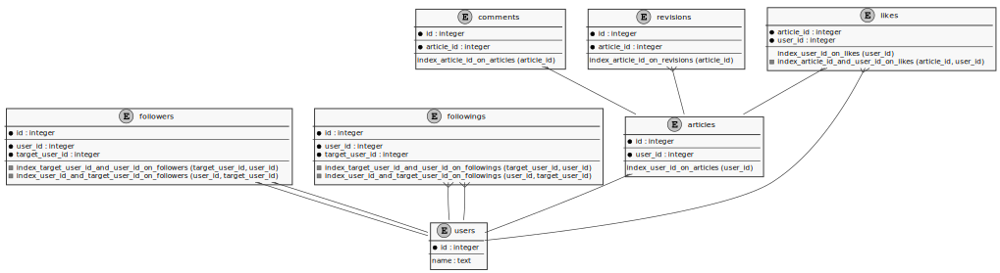
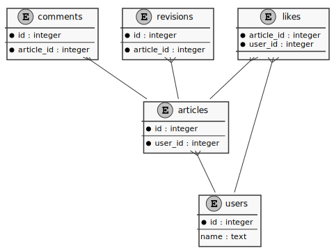

# PlantERD
ERD exporter with [PlantUML](https://plantuml.com/) format

[](https://github.com/sue445/plant_erd/actions?query=workflow%3Atest)

## Example
```bash
$ ./plant_erd sqlite3 --database /path/to/test_db.sqlite3

entity articles {
  * id : integer
  --
  * user_id : integer
  --
  index_user_id_on_articles (user_id)
}

entity users {
  * id : integer
  --
  name : text
}

articles }-- users
```


## Features
* Output ERD from real database
* Output ERD to stdout or file
* Output only tables adjacent to each other with a foreign key from a specific table

## Supports
* SQLite3
* MySQL: 5.6, 5.7, 8
* PostgreSQL: 9, 10, 11, 12

## Usage
Download latest binary from https://github.com/sue445/plant_erd/releases and `chmod 755`

### SQLite3
```
$ ./plant_erd sqlite3 --help
NAME:
   plant_erd sqlite3 - Output erd from sqlite3

USAGE:
   plant_erd sqlite3 [command options] [arguments...]

OPTIONS:
   -d value, --distance value  Search surrounding tables within distance (default: 0)
   --database value            SQLite3 Database file
   -f value, --file value      Filepath for output (default. stdout)
   -t value, --table value     Search surrounding tables
```

### MySQL
```bash
$ ./plant_erd mysql --help
NAME:
   plant_erd mysql - Output erd from mysql

USAGE:
   plant_erd mysql [command options] [arguments...]

OPTIONS:
   --collation value           MySQL collation (default: "utf8_general_ci")
   -d value, --distance value  Search surrounding tables within distance (default: 0)
   --database value            MySQL database name
   -f value, --file value      Filepath for output (default. stdout)
   --host value                MySQL host (default: "localhost")
   --password value            MySQL password [$MYSQL_PASSWORD]
   --port value                MySQL port (default: 3306)
   -t value, --table value     Search surrounding tables
   --user value                MySQL user (default: "root")
```

### PostgreSQL
```bash
$ ./plant_erd postgresql --help
NAME:
   plant_erd postgresql - Output erd from PostgreSQL

USAGE:
   plant_erd postgresql [command options] [arguments...]

OPTIONS:
   -d value, --distance value  Search surrounding tables within distance (default: 0)
   --database value            PostgreSQL database name
   -f value, --file value      Filepath for output (default. stdout)
   --host value                PostgreSQL host (default: "localhost")
   --password value            PostgreSQL password [$POSTGRES_PASSWORD]
   --port value                PostgreSQL port (default: 5432)
   --sslmode value             PostgreSQL sslmode. c.f. https://www.postgresql.org/docs/current/libpq-connect.html#LIBPQ-PARAMKEYWORDS (default: "disable")
   -t value, --table value     Search surrounding tables
   --user value                PostgreSQL user
```

## About `--table` and `--distance`
When `--table` and `--distance` are passed, Output only tables adjacent to each other with a foreign key from a specific table.

### Example 1: Output all tables
```bash
$ ./plant_erd sqlite3
```



### Example 2: Output only tables within a distance of 1 from the articles
```bash
$ ./plant_erd sqlite3 --table articles --distance 1
```



## Testing
### with all databases
Run test in container

```bash
docker-compose up --build --abort-on-container-exit
```

### without MySQL and PostgreSQL
Run test on local

```bash
make test
```
