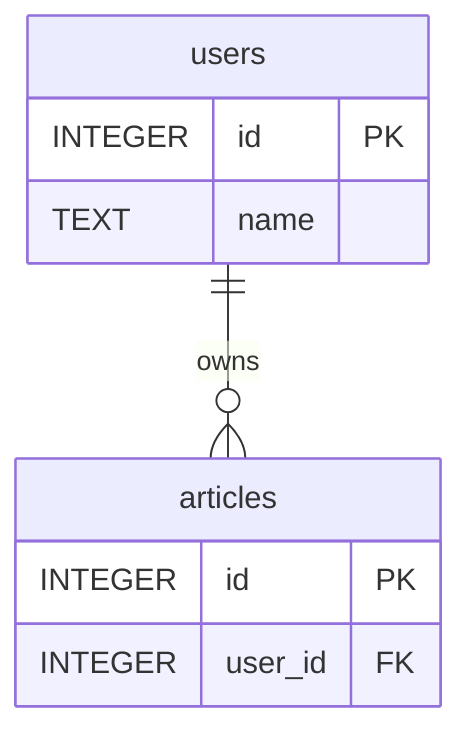

# PlantERD
ERD exporter with [PlantUML](https://plantuml.com/) and [mermaid](https://mermaid-js.github.io/mermaid/) format

[](https://github.com/sue445/plant_erd/actions/workflows/test.yml)
[](https://github.com/sue445/plant_erd/actions/workflows/build.yml)
[](https://coveralls.io/github/sue445/plant_erd?branch=master)
[](https://codeclimate.com/github/sue445/plant_erd/maintainability)
[](https://goreportcard.com/report/github.com/sue445/plant_erd)

## Example (PlantUML)
```bash
$ ./plant_erd sqlite3 --database /path/to/test_db.sqlite3

entity articles {
  * id : integer
  --
  * user_id : integer
  --
  index_user_id_on_articles (user_id)
}

entity users {
  * id : integer
  --
  name : text
}

articles }-- users
```


## Example (mermaid)
```bash
$ ./plant_erd sqlite3 --database /path/to/test_db.sqlite3 --format=mermaid --show-comment

erDiagram

articles {
  INTEGER id PK
  INTEGER user_id FK
}

users {
  INTEGER id PK
  TEXT name
}

users ||--o{ articles : owns
```



## Features
* Output ERD from real database
* Output ERD to stdout or file
* Output only tables within a certain distance adjacent to each other with foreign keys from a specific table

## Supported databases
* SQLite3
* MySQL: 5.6, 5.7, 8
* PostgreSQL: 9, 10, 11, 12, 13, 14, 15
* Oracle

## Supported output formats
* [PlantUML](https://plantuml.com/)
* [mermaid](https://mermaid-js.github.io/mermaid/)

## Setup
Download latest binary from https://github.com/sue445/plant_erd/releases and `chmod 755`

* `plant_erd` : for SQLite3, MySQL and PostgreSQL
* `plant_erd-oracle` : for Oracle

### Setup for `plant_erd-oracle`
`plant_erd-oracle` requires Basic Package or Basic Light Package in [Oracle Instant Client](https://www.oracle.com/database/technologies/instant-client.html)

#### Example (Linux)
```bash
mkdir -p /opt/oracle
wget --quiet --tries=0 https://download.oracle.com/otn_software/linux/instantclient/193000/instantclient-basiclite-linux.x64-19.3.0.0.0dbru.zip
unzip -q instantclient-basiclite-linux.x64-19.3.0.0.0dbru.zip -d /opt/oracle
export LD_LIBRARY_PATH=/opt/oracle/instantclient_19_3

# for Ubuntu
apt-get update
apt-get install -y libaio1
```

#### Example (Mac)
See https://github.com/kubo/ruby-oci8/blob/master/docs/install-on-osx.md and install `instantclient-basic` or `instantclient-basiclite`

Also, you can install with https://github.com/InstantClientTap/homebrew-instantclient

e.g.

```bash
brew install InstantClientTap/instantclient/instantclient-basiclite

OCI8_PREFIX="$(brew --prefix)/lib/"
echo $OCI8_PREFIX

vi oci8.pc
```

`oci8.pc` is following. (Replace `__REPLACE_WITH_OCI8_PREFIX__` with `$OCI8_PREFIX` )

```
prefix=__REPLACE_WITH_OCI8_PREFIX__
libdir=${prefix}
includedir=${prefix}/sdk/include/

Name: oci8
Description: Oracle Instant Client
Version: 19.8
Libs: -L${libdir} -lclntsh
Libs.private:
Cflags: -I${includedir}
```

```bash
cp oci8.pc "$(brew --prefix)/lib/pkgconfig/"
```

#### Example (Windows)
1. Go to https://www.oracle.com/database/technologies/instant-client/winx64-64-downloads.html
2. Download `instantclient-basic-windows.x64-19.5.0.0.0dbru.zip` or `instantclient-basiclite-windows.x64-19.5.0.0.0dbru.zip`
3. Extract zip
4. Move `plant_erd-oracle` to same directory as `oci.dll`

## Usage
### SQLite3
```
$ ./plant_erd sqlite3 --help
NAME:
   plant_erd sqlite3 - Generate ERD from sqlite3

USAGE:
   plant_erd sqlite3 [options]

OPTIONS:
   --database DATABASE               SQLite3 DATABASE file
   --distance DISTANCE, -d DISTANCE  Output only tables within a certain DISTANCE adjacent to each other with foreign keys from a specific table (default: 0)
   --file FILE, -f FILE              FILE for output (default: stdout)
   --format string                   Output format (plant_uml, mermaid. default:plant_uml)
   --show-comment                    Show column comment. This option is used only --format=mermaid
   --skip-index, -i                  Whether don't print index to ERD. This option is used only --format=plant_uml
   --skip-table string, -s string    Skip generating table by using regex patterns
   --table TABLE, -t TABLE           Output only tables within a certain distance adjacent to each other with foreign keys from a specific TABLE
   --help, -h                        show help
```

### MySQL
```bash
$ ./plant_erd mysql --help
NAME:
   plant_erd mysql - Generate ERD from mysql

USAGE:
   plant_erd mysql [options]

OPTIONS:
   --collation COLLATION             MySQL COLLATION (default: "utf8_general_ci")
   --database DATABASE               MySQL DATABASE name
   --distance DISTANCE, -d DISTANCE  Output only tables within a certain DISTANCE adjacent to each other with foreign keys from a specific table (default: 0)
   --file FILE, -f FILE              FILE for output (default: stdout)
   --format string                   Output format (plant_uml, mermaid. default:plant_uml)
   --host HOST                       MySQL HOST (default: "localhost")
   --password PASSWORD               MySQL PASSWORD [$MYSQL_PASSWORD]
   --port PORT                       MySQL PORT (default: 3306)
   --show-comment                    Show column comment. This option is used only --format=mermaid
   --skip-index, -i                  Whether don't print index to ERD. This option is used only --format=plant_uml
   --skip-table string, -s string    Skip generating table by using regex patterns
   --table TABLE, -t TABLE           Output only tables within a certain distance adjacent to each other with foreign keys from a specific TABLE
   --user USER                       MySQL USER (default: "root")
   --help, -h                        show help
```

### PostgreSQL
```bash
$ ./plant_erd postgresql --help
NAME:
   plant_erd postgresql - Generate ERD from PostgreSQL

USAGE:
   plant_erd postgresql [options]

OPTIONS:
   --database DATABASE               PostgreSQL DATABASE name
   --distance DISTANCE, -d DISTANCE  Output only tables within a certain DISTANCE adjacent to each other with foreign keys from a specific table (default: 0)
   --file FILE, -f FILE              FILE for output (default: stdout)
   --format string                   Output format (plant_uml, mermaid. default:plant_uml)
   --host HOST                       PostgreSQL HOST (default: "localhost")
   --password PASSWORD               PostgreSQL PASSWORD [$POSTGRES_PASSWORD]
   --port PORT                       PostgreSQL PORT (default: 5432)
   --show-comment                    Show column comment. This option is used only --format=mermaid
   --skip-index, -i                  Whether don't print index to ERD. This option is used only --format=plant_uml
   --skip-table string, -s string    Skip generating table by using regex patterns
   --sslmode SSLMODE                 PostgreSQL SSLMODE. c.f. https://www.postgresql.org/docs/current/libpq-connect.html#LIBPQ-PARAMKEYWORDS (default: "disable")
   --table TABLE, -t TABLE           Output only tables within a certain distance adjacent to each other with foreign keys from a specific TABLE
   --user USER                       PostgreSQL USER
   --help, -h                        show help
```

### Oracle
```bash
$ ./plant_erd-oracle --help
NAME:
   plant_erd-oracle - ERD exporter with PlantUML and Mermaid format (for oracle)

USAGE:
   plant_erd-oracle [global options]

VERSION:
   vX.X.X (build. xxxxxxx)

GLOBAL OPTIONS:
   --file FILE, -f FILE              FILE for output (default: stdout)
   --table TABLE, -t TABLE           Output only tables within a certain distance adjacent to each other with foreign keys from a specific TABLE
   --distance DISTANCE, -d DISTANCE  Output only tables within a certain DISTANCE adjacent to each other with foreign keys from a specific table (default: 0)
   --skip-index, -i                  Whether don't print index to ERD. This option is used only --format=plant_uml
   --skip-table string, -s string    Skip generating table by using regex patterns
   --format string                   Output format (plant_uml, mermaid. default:plant_uml)
   --show-comment                    Show column comment. This option is used only --format=mermaid
   --user USER                       Oracle USER
   --password PASSWORD               Oracle PASSWORD [$ORACLE_PASSWORD]
   --host HOST                       Oracle HOST (default: "localhost")
   --port PORT                       Oracle PORT (default: 1521)
   --service SERVICE                 Oracle SERVICE name
   --help, -h                        show help
   --version, -v                     print the version
```

## About `--table` and `--distance`
When `--table` and `--distance` are passed, output only tables within a certain distance adjacent to each other with foreign keys from a specific table.

### Example 1: Output all tables
```bash
$ ./plant_erd sqlite3
```


### Example 2: Output only tables within a distance of 1 from the articles
```bash
$ ./plant_erd sqlite3 --table articles --distance 1
```


## Testing
### with all databases
Run test in container

```bash
docker-compose up --build --abort-on-container-exit
```

### with only SQLite3
Run test on local

```bash
make test
```

## License
The program is available as open source under the terms of the [MIT License](http://opensource.org/licenses/MIT).

But `plant_erd-oracle` contains [Oracle Instant Client](https://www.oracle.com/database/technologies/instant-client.html).
Oracle Instant Client is under [OTN License](https://www.oracle.com/downloads/licenses/distribution-license.html).
